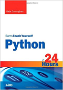

```
Roberto Nogueira  BSd EE, MSd CE
Solution Integrator Experienced - Certified by Ericsson
```

# Python in 24 hours



## Table of Contents

```
Python in 24 Hours

Table of Contents

[x] HOUR  1  Installing and Running Python
[ ] HOUR  2  Putting Numbers to Work in Python
[ ] HOUR  3  Logic in Programming
[ ] HOUR  4  Storing Text in Strings
[ ] HOUR  5  Processing Input and Output
[ ] HOUR  6  Grouping Items in Lists
[ ] HOUR  7  Using Loops to Repeat Code
[ ] HOUR  8  Using Functions to Create Reusable Code
[ ] HOUR  9  Using Dictionaries to Pair Keys with Values
[ ] HOUR 10  Making Objects
[ ] HOUR 11  Making Classes
[ ] HOUR 12  Expanding Classes to Add Functionality
[ ] HOUR 13  Using Python’s Modules to Add Functionality
[ ] HOUR 14  Splitting Up a Program
[ ] HOUR 15  Providing Documentation for Code
[ ] HOUR 16  Working with Program Files
[ ] HOUR 17  Sharing Information with JSON 
[ ] HOUR 18  Storing Information in Databases
[ ] HOUR 20  Developing for the Web with Flask 
[ ] HOUR 21  Making Games with PyGame 
[ ] HOUR 22  Saving Your Code Properly Through Versioning
[ ] HOUR 23  Fixing Problem Code 
[ ] HOUR 24  Taking the Next Steps with Python
```
